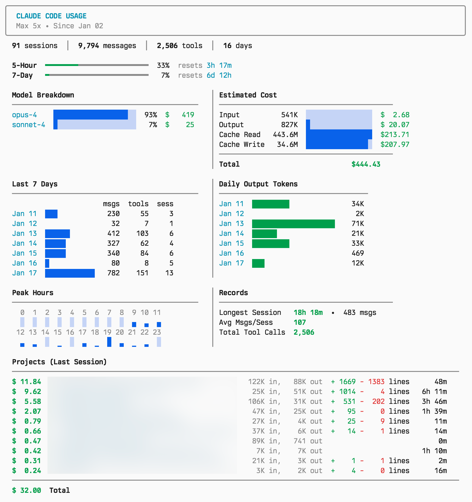

# Claude Code Usage

A CLI tool to display Claude Code usage statistics.

<p align="center">
  
</p>

## Features

- **Usage limits** - 5-hour and 7-day utilization with reset timers
- **Model breakdown** - Token usage and cost estimates by model
- **Activity tracking** - Daily messages, tool calls, and sessions
- **Peak hours** - Heatmap showing when you're most active
- **Token trends** - Daily output token usage over time
- **Project costs** - Per-project cost tracking with lines changed

## Usage

```bash
uv run stats.py
# or (the script uses a `uv run` shebang)
./stats.py
```

Or add an alias to your shell config:

```bash
alias cstats="/path/to/stats.py"
```

## Requirements

- macOS (uses Keychain for OAuth)
- Python 3.11+
- [uv](https://github.com/astral-sh/uv)

## Data Sources

- `~/.claude/stats-cache.json` - Local usage statistics
- `~/.claude.json` - Project history
- Anthropic OAuth API - Rate limits (requires Claude Code login)
