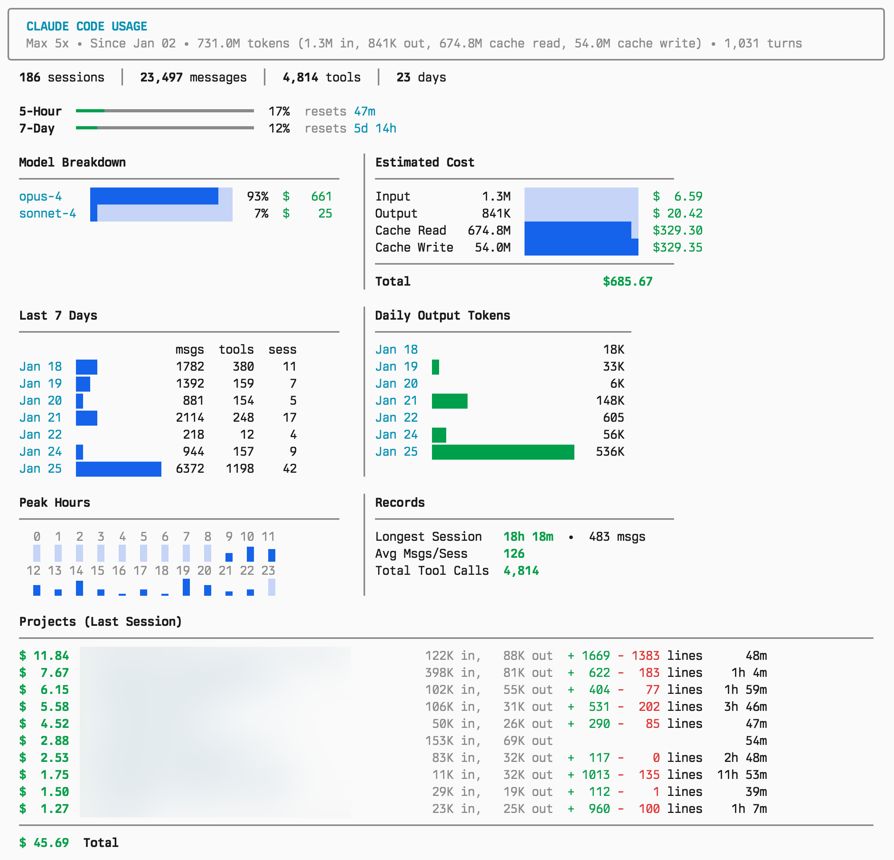
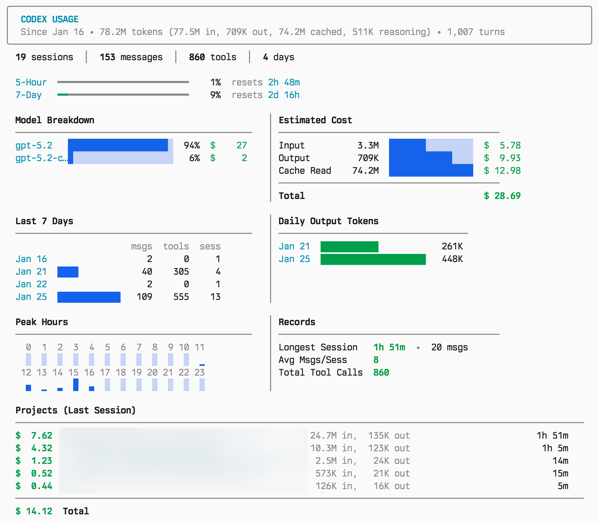

# Agent CLI Statistics

CLI tools to display usage statistics for **Claude Code** and **Codex CLI**.

<p align="center">
  
  
</p>

## Claude Code Stats

```bash
uv run claude_code_stats.py
# or
./claude_code_stats.py
```

Or add an alias:

```bash
alias cstats="/path/to/claude_code_stats.py"
```

### Data Sources

- `~/.claude/stats-cache.json` - Local usage statistics
- `~/.claude.json` - Project history
- Anthropic OAuth API - Rate limits (requires Claude Code login)

## Codex Stats

```bash
uv run codex_stats.py
# or
./codex_stats.py
```

Or add an alias:

```bash
alias xstats="/path/to/codex_stats.py"
```

### Data Source

- `$CODEX_HOME/sessions/` (default: `~/.codex/sessions/`) - Session logs

## Requirements

- macOS (uses Keychain for OAuth in Claude Code stats)
- Python 3.11+
- [uv](https://github.com/astral-sh/uv)

## License

MIT
